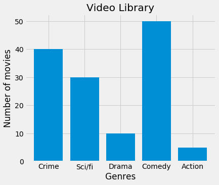
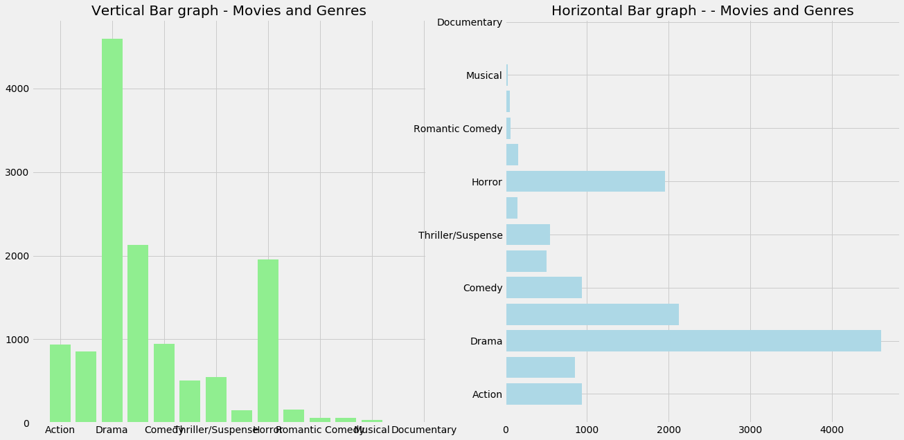
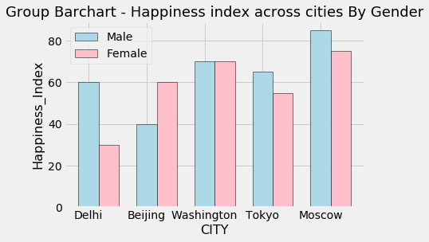
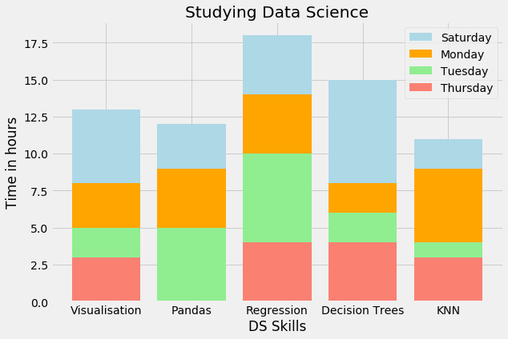

## Data Visualisation : Comparisons with Bar Charts

Create bar graphs for given exercises. 

## Exercise 1

Make a vertical bar graph for the following set of data:

> ### Jim's Video Library contains 40 crime/mystery, 30 science fiction, 10 drama, 50 comedy, 25 action and 5 documentary movies.

* Use a different style for the bar graph
* Label the axes and Give a title
* Set the Genres at x-ticks


```python
# import the required libraries
import numpy as np
import matplotlib.pyplot as plt
plt.style.use('fivethirtyeight')

y = [40,30,10,50,5]
labels = ['Crime', 'Sci/fi', 'Drama', 'Comedy', 'Action', 'Documentary' ]

x = np.arange(len(y))

# Create a new figure object
fig = plt.figure(figsize =(6,5))

# Create an axes 
ax = fig.add_subplot(111)

# Plot vertical bars of fixed width by passing x and y values to .bar() function 
ax.bar(x, y)

# Give a title to the bar graph
plt.title('Video Library')
plt.ylabel('Number of movies')
plt.xlabel('Genres')
plt.xticks(x, labels)


# Output the final plot
plt.show()
```





## Exercise 2

Let's extend above example for a lmuch larger movie collection. Number of movies and genre labels have been provided as python lists below. Draw vertical vs horizontal bar plots as subplots and comment of suitability of both with an increased number of genres. 

* Apply all formatting to both subplots as above. 


```python
labels = ['Adventure', 'Action', 'Drama', 'Comedy', 'Thriller/Suspense', 'Horror', 'Romantic Comedy', 'Musical',
         'Documentary', 'Black Comedy', 'Western', 'Concert/Performance', 'Multiple Genres', 'Reality']
quantity = [
    941,
    854,
    4595,
    2125,
    942,
    509,
    548,
    149,
    1952,
    161,
    64,
    61,
    35,
    5
]
```


```python
# Prepare the dataset
y = quantity
x = np.arange(len(y))

# Create a figure with two columns 
fig, axes = plt.subplots(ncols=2, figsize=(20,10))

vert_bars = axes[0].bar(x, y, color='lightgreen', align='center')
horiz_bars = axes[1].barh(x, y, color='lightblue', align='center')

# Set titles for both axes
axes[0].set_title("Vertical Bar graph - Movies and Genres")
axes[0].set_xticklabels(labels)
axes[1].set_title("Horizontal Bar graph - - Movies and Genres")
axes[1].set_yticklabels(labels)

# Show the final plot
plt.show()

```





```python
# We can see that horizontal bar graph is much easier to view, compare and interpret with labels clearly readable. 
# We can, however, apply rotation to labels of vertical bar graph to make it more readable 
```

##  Exercise 3

Following data presents a subset of happiness index for males and females for some of the major cities in world. Draw a grouped bar chart to show both gendres for all the cities. Label the plot, give it a title and briefly 
comment on the output.

    city=['Delhi','Beijing','Washington','Tokyo','Moscow']
    happiness_male=[60,40,70,65,85]
    happiness_female=[30,60,70,55,75]


```python
city=np.array(['Delhi','Beijing','Washington','Tokyo','Moscow'])
happiness_male=np.array([60,40,70,65,85])
happiness_female=np.array([30,60,70,55,75])
```


```python
# Create labels for genders
Gender=['Male','Female']

# Set the label position from city list
pos = np.arange(len(city))

#P lot the bars
bar_width = 0.35
plt.bar(pos,happiness_male, bar_width, color='lightblue',edgecolor='black')
plt.bar(pos+bar_width, happiness_female, bar_width, color='pink', edgecolor='black')

# Label the ticks and axes
plt.xticks(pos, city)
plt.xlabel('CITY', fontsize=16)
plt.ylabel('Happiness_Index', fontsize=16)

# Show the title and the legend
plt.title('Group Barchart - Happiness index across cities By Gender',fontsize=18)
plt.legend(Gender,loc=0)
plt.show()

```





```python
# Stuents may comment on the fact that delhi(India) has much less happy females than males. 
# Washington(USA) has equally happy males and females
# In Moscow(Russia) , females are much happier than males

# All to do  socio-economic factors in these countries
```

## Exercise 4

Create a stacked bar chart with following data. This represents number of hours spent on each day for studying number of data science skills for 4 days in a week.
    
    Saturday = [5, 3, 4, 7, 2]
    Monday = [3, 4, 4, 2, 5]
    Tuesday = [2, 5, 6, 2, 1]
    Thursday= [3, 0, 4, 4, 3]
    skills = visualisation, pandas, regression, decision trees, KNN clustering
    
The scatter plot should highlight each skill on the x-axis and how much time is being spent on it for the four days shown above.


```python
sat = np.array([5, 3, 4, 7, 2])
mon = np.array([3, 4, 4, 2, 5])
tues = np.array([2, 5, 6, 2, 1])
thurs = np.array([3, 0, 4, 4, 3])
labels = ['Visualisation','Pandas','Regression','Decision Trees','KNN']
```


```python
# Set the index for number of classes
ind = np.arange(len(labels))

## Create a single figure and axes object
fig, ax = plt.subplots(figsize=(9,6))

#Create the rectangles while using bottom argument 
ax.bar(ind, data1, width=0.8, label='Saturday', color='lightblue', bottom=data2+data3+data4)
ax.bar(ind, data2, width=0.8, label='Monday', color='orange', bottom=data3+data4)
ax.bar(ind, data3, width=0.8, label='Tuesday', color='lightgreen', bottom = data4)
ax.bar(ind, data4, width=0.8, label='Thursday', color='salmon')

# Set the labels and titles

ax.set_ylabel("Time in hours")
ax.set_xlabel("DS Skills")
plt.legend(loc="upper right")
plt.title("Studying Data Science")
plt.xticks(ind, labels)

plt.show()
```




